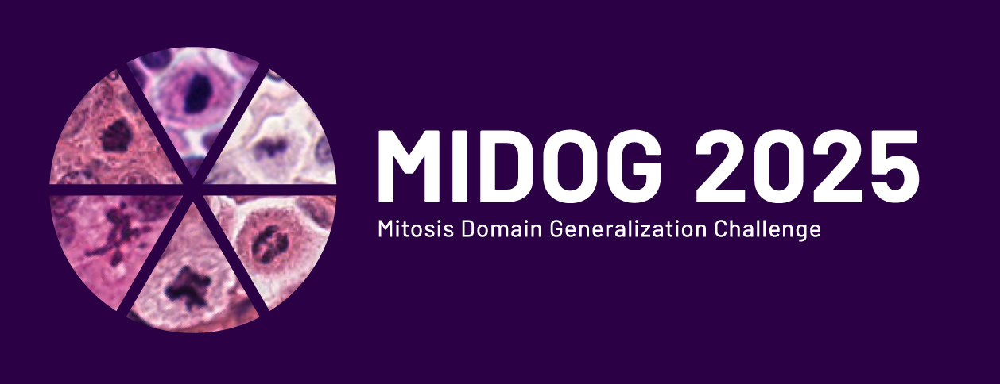

# MIDOG 2025 Challenge

Welcome to the official repository of the MIDOG 2025 Challenge (3rd iteration of the MIDOG Challenge series).

## Overview

This repository contains example implementations and utilities for participating in the MIDOG 2025 Challenge. The challenge focuses on advancing robust and automated mitosis detection across histopathology images of different tumor types.

🔗 **Official Challenge Website:** [MIDOG 2025](https://midog2025.deepmicroscopy.org/)

For challenge registration and detailed information about the competition, rules, and deadlines, please visit the official website.

## Community 

<a href="https://discord.gg/xEuqXjMqTk">

</a>

Join our Discord community to connect with other participants, ask questions, and share insights!

## Repository Contents

This repository includes:

- `MIDOG2025_01_Exploratory_Data_Analysis.ipynb`: A notebook introducing the MIDOGpp dataset with exploratory data analysis
- `MIDOG2025_02_Simple_Training.ipynb`: Example implementation of a basic object detection pipeline
- `MIDOG2025_03_AMF_Classification.ipynb`: Example implementation of a basic classification pipeline
- `requirements.txt`: Required Python packages for running the notebooks
- `utils/`: Utility functions and helper scripts

⚠️ **Important Note**: The provided notebooks are meant to serve as examples and starting points. We strongly encourage participants to be creative and develop their own implementations to achieve better results.

## Getting Started

### Prerequisites

- Python 3.10 or higher
- CUDA-capable GPU (recommended for training)
- Openslide 

### Installation

1. Clone this repository:
```bash
git clone git@github.com:DeepMicroscopy/MIDOG_2025_Guide.git
cd MIDOG_2025_Guide
```

2. Create and activate a virtual environment (recommended):
```bash
python -m venv midog_env
source midog_env/bin/activate  # On Windows: midog_env\Scripts\activate
```

3. Install the required packages:
```bash
pip install -r requirements.txt
```

## Dataset Access

The [MIDOGpp](https://github.com/DeepMicroscopy/MIDOGpp) dataset used in this repository is available online and can be downloaded with the `download_MIDOGpp.py` script. The links to download the datasets for classification can be found at our [MIDOG 2025 Datasets Page](https://midog2025.deepmicroscopy.org/datasets/).

## Example Notebooks

### 1. Dataset Exploration
The first notebook (`MIDOG2025_01_Exploratory_Data_Analysis.ipynb`) provides:
- Dataset structure overview
- Statistical analysis of mitosis distributions
- Visualization of sample images and annotations


### 2. Basic Object Detection Pipeline
The second notebook (`MIDOG2025_02_Simple_Training.ipynb`) demonstrates:
- How to prepare the dataset for training
- How to use this repository to create a model 
- A simple model training setup
- Visualizations of predictions

### 3. Basic Classification Pipeline
The third notebook (`MIDOG20205_03_AMF_Classification.ipynb`) demonstrates:
- How to download the MIDOG 2025 Atypical Dataset
- Exploratory analysis of atypical mitotic figures
- A simple model training setup with k-fold cross validation


## Additional Resources

- [Challenge Overview](https://zenodo.org/records/15077361)
- [Datasets](https://midog2025.deepmicroscopy.org/datasets/)
- [Previous MIDOG 2022 Challenge Publication](https://www.sciencedirect.com/science/article/pii/S136184152400080X)


